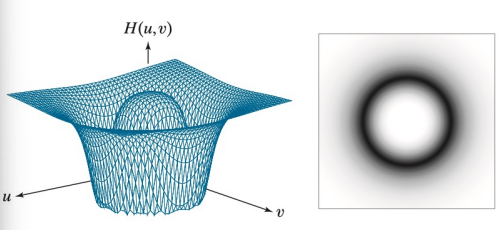
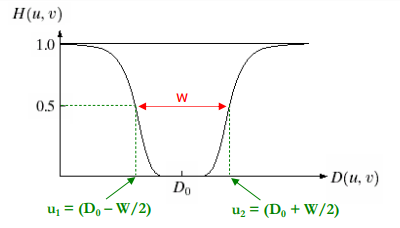
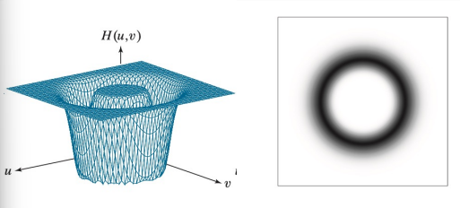
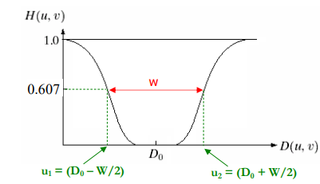

# 📘 Discretização de Sistemas 📘 #
> Este resumo contém informações referentes a processamento de Imagens no Domínio da Frequência. Aqui, teremos o desenvolvimento da teoria de filtros passa alta e baixa, assim como rejeita e passa banda.

# Filtragem sem alteração de fase # 

O filtro H(u,v) deve multiplicar a matriz complexa F(u,v) para garantir que a fase não seja alterada no processo de filtragem. Esse tipo de filtro é chamado de *zero-phase shift filters* 

# 📕 Filtos Passa-Baixa 📕 # 

O filtro passa-baixa retira (ou atenua) as ondas senoidas de alta frequência espacial (acima da frequência de corte $D_0$, definida na construção do filtro). Logo, será mantido somente as ondas senoidas de baixa-frequência espacial, ou sejam que estão abaixo da frequência de corte pré definida. 

>[!CAUTION]
>Não há aumento da amplitude de nenhuma onda senoidal no espectro de Fourier da Imagem.

Os filtros passa-baixa podem ser de vários tipos. Entre eles, podemos citar os filtros: Ideal, Butterworth e Gaussiano. 

## Filtro Passa-Baixa Ideal ## 

Definimos o filtro Passa-Baixa Ideal como: 

$$
H(u,v) =
\begin{cases}
1, & \text{se } D(u,v) \le D_0 \\
0, & \text{se } D(u,v) > D_0
\end{cases}
$$

Neste caso, todas as ondas senoidas de frequência acima da frequência de corte ($D_0$) são retiradas da imagem, enquanto as ondas de frequência mais baixas que $D_0$ não são alteradas. 

## Filtro Passa-Baixa Butterworth ## 

O filtro passa-baixa de Butterworth é definido por: 

$$
H(u,v) = \frac{1}{1 + \left[ \frac{D(u,v)}{D_0} \right]^{2n}}
$$

No caso, a frequência de corte $D_0$ define o valor onde a amplitude da onda é reduzida em 50%. Vale ressaltar também que as ondas de alta-frequência são cada vez mais atenuadas na imagem a medida que são maiores que $D_0$, ou seja, o filtro possui uma transição mais suave que o filtro ideal. 

O valor de **n** determina a suavidade do filtro. 

## Filtro Passa-Baixa Gaussiano ## 

Define-se o filtro Passa-Baixa Gaussiano com a seguinte expressão: 

$$
H(u,v) = e^{-\frac{[D(u,v)]^2}{2D_0^2}}
$$

Nele, a frequência de corte ($D_0$) define o valor onde a amplitude da onda é reduzida em 60,7%. Como o Butterworh, as ondas de alta-frequência são cada vez mais atenuadas na imagem, a medida que são maiores que a frequência de corte, ou seja, esse filtro possui transição mais suave que o ideial (e tende a ser bem mais suave que o Butterworth também). 

# 📕 Filtro Passa-Alta 📕 # 

O filtro passa-alta retira (ou atenua) as ondas senoidas de baixa frequência espacial (abaixo da frequência de corte $D_0$, definida na construção do filtro). Logo, será mantido somente as ondas senoidas de alta-frequência espacial, ou sejam que estão acima da frequência de corte pré definida. 

>[!CAUTION]
>Não há aumento da amplitude de nenhuma onda senoidal no espectro de Fourier da Imagem.

Os filtros passa-alta podem ser de vários tipos. Entre eles, podemos citar os filtros: Ideal, Butterworth e Gaussiano, de maneira semelhante aos Filtros Passa-Baixa. 

## Filtro Passa-Alta Ideal ## 

$$
H(u,v) =
\begin{cases}
0, & \text{se } D(u,v) \le D_0 \\
1, & \text{se } D(u,v) > D_0
\end{cases}
$$

No caso do filtro passa-alta ideial, todas as ondas senoidais de frequência abaixo da frequência de corte são retiradas da imagem, sendo que somente as ondas de frequência mais altas que $D_0$ não são alteradas. 

## Filtro Passa-Alta Butterworth ## 

Define-se a função H(u,v) do filtro de Butterworth como: 

$$
H(u,v) = \frac{1}{1 + \left[ \frac{D_0}{D(u,v)} \right]^{2n}}
$$

Neste caso, a frequência de corte define o valor onde a amplitude da onda senoidal é reduzida em 50%. Ondas de baixa frequência são cada vez mais atenuadas na imagem a medida que são menores que $D_0$, ou seja, o filtro possui transição mais suave que o filtro ideal. Igual ao Butterworth do passa-baixa, o valor de **n** determina a "suavidade" do filtro. 

## Filtro Passa-Alta Gaussiano ## 

No caso do filtro Gaussiano, o mesmo é definido por: 

$$
H(u,v) = 1 - e^{-\frac{[D(u,v)]^2}{2D_0^2}}
$$

A frequência de corte define o valor onde a amplitude da onda senoidal é reduzida em 60,7%. As ondas de baixa frequência são cada vez mais atenuadas na imagem a medida que são menores que $D_0$, ou seja, o filtro possui, assim como o filtro de Butterworth, uma transição mais suave que o filtro ideal. Vale ressaltar que o filtro Gaussiano pode ser bem mais suave que o filtro Butterworth. 

# 📕 Filtros Rejeita-Banda 📕 # 

O filtro rejeita banda retira ou atenua as ondas senoidas cujas frequências espaciais estão dentro de uma faixa definida na construção do filtro. Como nos outros tipos de filtros, não ocorre aumento na amplitude de nenhuma onda senoidal do espectro de Fourier. Vale ressaltar que esse tipo de filtro são projetados a partir da combinação de filtros passa-baixa e passa-alta, como já vistos anteriormente. Como eles são uma composição de outros filtros, os modelos mais comuns são filtros: ideais, Butterworth e Gaussiano. 

## Filtro Rejeita-Banda Ideal ## 

No caso, esse filtro é definido pela seguinte equação: 

$$
\begin{equation}
H(u,v) = 
\begin{cases} 
  1, & \text{se } D(u,v) < (D_0 - W/2) \\
  0, & \text{se } (D_0 - W/2) \le D(u,v) \le (D_0 + W/2) \\
  1, & \text{se } D(u,v) > (D_0 + W/2)
\end{cases}
\end{equation}
$$

Neste tipo de filtro, as ondas senoidas cuja frequência espacial pertenece à faixa definida por W (banda) são retiradas da imagem. As ondas cujas frequências são externas à W não são alterados. ($D_0$) corresponde ao centro da banda W, onde o valor do filtro deve ser zero, enquanto $u_1$ e $u_2$ são as frequências de corte do filtro. 

  
  

## Filtro Rejeita-Banda Butterworth ## 

Este tipo de filtro é definido pela seguinte equação: 

$$
H(u, v) = \frac{1}{1 + \left[ \frac{D(u, v) \cdot W}{D(u, v)^2 - D_0^2} \right]^{2n}}
$$

No caso, o centro da banda $D_0$ define o valor onda a amplitude do filtro é zero. Semelhantemente ao caso anterior, as frequências de corte $u_1$ e $u_2$ definem os valores onde a amplitude da onda senoidal é reduzida em 50%. As ondas senoidais de frequência espacial dentro da faixa definida são cada vez mais atenuadas na imagem a medida que se aproximam de $D_0$, ou seja, o filtro possui uma transição mais suave que o filtro ideal. Como já visto anteriormente, o índice **n** determina a suavidade do filtro. 

  
  

## Filtro Rejeita-Banda Gaussiano ## 

Assim como no caso anterior, o centro da banda ($D_0$) define o valor onde a amplitude do filtro é zero, assim como as frequências de corte definem os valores onde a amplitude da onda senoidal é reduzida em 60,7%. As ondas senoidais de frequência espacial dentro da faixa definida são cada vez mais atenuadas na imagem a medida que se aproximam de $D_0$, ou seja, o filtro possui uma transição mais suave que o filtro ideal. Vale destacar que o filtro Gaussiano pode ser bem mais suave que o filtro Butterworth. 

Define-se o filtro Gaussiano pela seguinte expressão abaixo: 

$$
H(u, v) = 1 - e^{-\left[ \frac{D(u, v)^2 - D_0^2}{D(u, v) \cdot W} \right]^2}
$$

A representação "gráfica" do filtro é demonstrada abaixo: 

  
  

# 📕 Filtro Passa-Banda 📕 # 

No caso do filtro de passa-banda, eles irão retirar (ou atenuar) as ondas senoidais cujas frequências espaciais estão fora de uma faixa (banda) definida na construção do filtro. Logo, será mantido apenas as ondas senoidais cujas frequências espaciais estão dentro da banda definida. 

>[!CAUTION]
> Não ocorre um aumento na amplitude de nenhuma onda senoidal do espectro de Fourier da Imagem.

Esse tipo de filtro é desenvolvido a partir da combinação de filtros passa-baixa e passa-alta, podendo ser de vários tipos, como já foi citado anteriormente. De maneira resumida, podemos definir as equações dos filtros de passa banda como a "negação lógica" dos filtros de rejeita banda, no caso, podemos relacionar ambas através da seguinte equação:

$$ 
H(u,v)_{PB} = 1 - H(u,v)_{RB}
$$

A única mudança é em relação ao valor de $D_0$, no qual, define o valor onde a amplitude do filtro é 1. 

