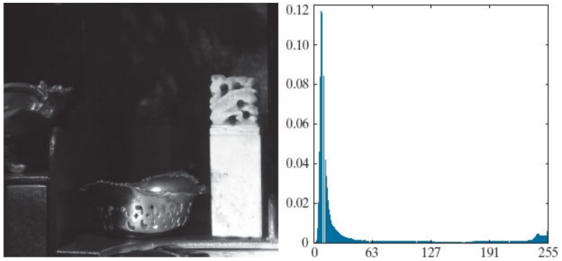
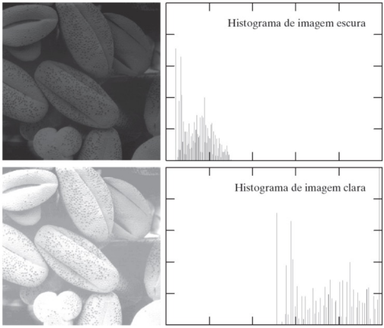
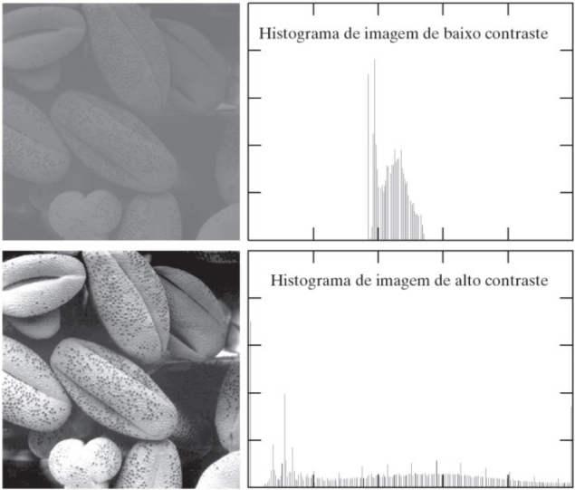

# Processamento Digital de Imagem - Anotações

## Métodos de Transformação Ponto a Ponto ## 

Quando estamos realizando transformações ponto a ponto, algumas informações sobre as imagens são extremamente importantes. Neste tópico, veremos transformaçõs utilizando: 

* Histograma;
* Transformações Lineares;
* Transformações Não-Lineares.

## Histogramas ##

O histograma de uma imagem em tons de cinza é uma função H(n) que produz o número de ocorrências de cada nível de cinza de uma imagem. No caso: 

$$
0 <= n <= L-1
$$

 Onde L é o tamanho da imagem. O histograma é de extrema importância para compreendermos a distribuição dos píxeis da imagem (ou seja, se uma imagem contém píxeis com um nível de cinza menor ou maior), além de ajudar na identificação de qual método de transformação (linear ou não), deverá ser aplicado para melhor visualização da imagem. 

 Vale ressaltar que o histograma não trás informações sobre a posição dos pixels, mas sim, somente a sua distruibuição (é uma função de distribuição de probabilidades). Abaixo, temos alguns exemplos de histogramas: 




Note que, nos histogramas acima, uma imagem escura tem uma maior concentração de nível de cinza em n mais baixos e a imagem clara em n mais altos. Com o conhecimento dos histogramas, podemos definir algo muito importante para o processamento de imagens que é o **Contraste**. 

No caso, o contraste se consiste na diferença entre níveis de cinza entre regiões. Logo, quando aumentamos o contraste de uma imagem, o histograma da mesma é mais preenchido (horizontalmente). Verifique a imagem abaixo para compreender a diferença entre uma imagem de baixo contraste com uma imagem de alto contraste. 



Para o plot de uma imagem, juntamente com um histograma, utiliza-se o seguinte programa em Python: 

```python
import requests 

def plot(imagem, nome):
  plt.figure(figsize=(5,5))
  plt.imshow(imagem, cmap = 'gray', vmin = 0, vmax = 255)
  shape = imagem.shape
  plt.title(f'{nome}. Dimensões:{imagem.shape}')
  plt.show()
  plt.hist(imagem.flatten(), bins = 50, density = False, range = (0,255))
  plt.xlim([0,255])
  plt.show()
  ```
## Transformações Lineares ## 
Em relação às transformações lineares, podemos realizar algumas operações: 

1) **Contraste e Brilho**:
   O **Brilho** é uma soma (aumento do brilho) ou subtração (diminuição do brilho) em uma imagem por uma constante. Isso ocorre pois estamos somando um valor de uma constante por toda a imagem, aumentando o nível de cinza da mesma por esta certa constante. Deve-se tomar cuidado com essa operação para que o nível de cinza da mesma não seja ultrapassado do máximo (255). Em relação ao contraste, como já foi explicado anteriormente, o mesmo é a diferença dos níveis de cinza entre regiões. Logo, para que o mesmo seja aplicado em uma imagem, multiplicamos a mesma por uma constante. Logo, resumimos essa operação como:

$$
g(x,y) = c.f(x,y) + b
$$

Onde:
* c = contraste (constante);
* b = brilho (constante);
2) **Negativo**
3) **Binarização**
  Em relação à binarização de uma imagem, a mesma se consiste em transformar toda a imagem em apenas dois níveis de cinza (0 e 255), a partir de um certo limiar. No caso, para valores acima deste limiar, os píxeis são transformados no valor máximo e para valores abaixo, são transformados em zero.
   Para realizar este procedimento, existem algumas maneiras. Pode-se realizar esse processo de forma "manual"
