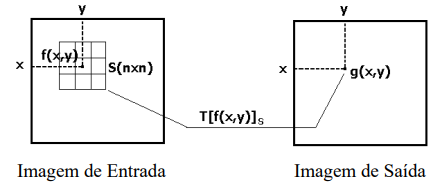

# 📘Transformação por Vizinhança #

Em relação às transformações por Vizinhança, iremos trabalhar com três tipos: 
1) Transformação por Convolução;
2) Transformação por Filtros Lineares;
3) Transformação por Máscara de Nitidez.

---

Antes de tratarmos especificamente sobre cada tipo de transformação por vizinhança, vamos entender do que a mesma se trata. Então um operador local (por vizinhança) combina a intensidade de um certo número de pixels para computar o valor da nova intensidade da Imagem de Saída, como demonstra a imagem abaixo: 



Onde T[f(x,y)] é a operação sobre todos os píxels dentro da janela S centrada em f(x,y). 

É importante também relembrar a definição de convolução e correlação cruzada, definidas abaixo: 

$$f(x) * h(x) = \int_{-\infty}^{+\infty} f(m)h(x - m)dm$$

$$f(x) \star h(x) = \int_{-\infty}^{+\infty} f(m)h(x + m)dm$$

---

## 🎨 Filtros Espaciais

Os filtros atuam no **domínio do espaço** (a própria imagem), modificando características de frequência:  
- **Baixa frequência** → regiões homogêneas (suavização).
- **Alta frequência** → bordas, detalhes e ruídos.  

--- 

## ⬇️ Filtros Passa-Baixa (Low-Pass)

### Objetivo:
- Suavizar a imagem.  
- Reduzir ruído.  
- Atenuar detalhes finos (altas frequências).  

### Características:
- Kernel com valores **positivos**.  
- Soma dos pesos = **1**.

### Exemplos de Kernels:

```python
kernel = np.array(((1, 1, 1),
                    (1, 1, 1),
                    (1, 1, 1))) / 9

kernel = np.array(((0, 1, 0),
                    (1, 1, 1),
                    (0, 1, 0))) / 5

kernel = np.array(((1, 3, 1),
                    (3, 16, 3),
                    (1, 3, 1))) / 32

kernel = np.array(((0,1,0),
                  (1,4,1),
                  (0,1,0))) / 8

```
---

## ⬆️ Filtros Passa-Alta (High-Pass)

### Objetivo:
- Destacar **bordas, linhas e detalhes finos**.  
- Aumentar a nitidez (sharpening).  

### Características:
- Kernel com valores **positivos e negativos**.  
- Soma dos pesos = **0**.
- Deve-se normalizar a matriz para que a imagem não "estoure" (passe de 255, provocando a perda de informação). Nesse tipo de filtro, a normalização ocorre com a diferença de contraste do filtro. No caso do primeiro exemplo abaixo, temos uma normalização de 1/9, pois: 8-(-1) = 8 + 1 = 9.

### Exemplos de Kernels:
```python
kernel = np.array(((-1, -1, -1),
                    (-1, 8, -1),
                    (-1, -1, -1))) / 9

kernel = np.array(((0, -1, 0),
                    (-1, 4, -1),
                    (0, -1, 0))) / 5

```

---

## Aplicação de Filtros passa-alta para aumento da nitidez (aguçamento) de imagens ## 

## Máscaras Isotrópicas ## 

---
## 📚 Referências ##

Material adaptado da disciplina SEL0449 & SEL5895 – Introdução ao Processamento Digital de Imagens,
Prof. Dr. Marcelo Andrade da Costa Vieira (EESC/USP).


